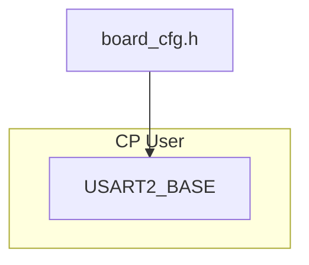

# Layout Safety

Use this reference whenever a diagram has arrows, labels, subgraph titles, or dense node groups.

## Non-Negotiable Rule

No connector line or arrowhead may cover readable text. Text includes node labels, group titles, legends, field names, values, and code identifiers.

Layering text above an arrow is not a valid fix if the arrow still passes through the text area. Route around the text instead.

## No-Connector Zones

Treat these as obstacles:

| Zone | Clearance |
|---|---|
| Single-line text | text box + 16 px |
| Multiline text | full multiline bounding box + 16 px |
| Group/subgraph title | title band + 24 px |
| Arrowhead landing area | keep 16 px away from text baseline |
| Node internal text | keep at least 10 px from card borders |
| Legend/source note | note box + 16 px |

## Arrowhead Sizing

Keep document arrowheads small enough that the connector line remains visible.

- Target rendered arrowhead size: 8-14 px for normal wiki diagrams.
- Hard ceiling: 24 px.
- For short connector segments, arrowhead size must be less than 65% of the final segment length.
- In hand-authored SVG, prefer `markerUnits="userSpaceOnUse"` for normal arrows. Avoid `markerUnits="strokeWidth"` with `markerWidth` / `markerHeight` above 8 on 2-3 px strokes.
- If a stacked flow has only 25-30 px between nodes, either increase the vertical gap or use a smaller marker. Do not let the arrowhead consume the whole segment.

## Text Inside Nodes

Text must be contained by the visual card, not merely have its baseline inside the rectangle.

- Before rendering a card, compute every line baseline.
- Approximate bottom clearance as `baseline + 0.25 * font-size`.
- Require that value to be at least 10 px above the rectangle bottom.
- If it fails, increase the card height, move the text block up, reduce font size, or split the label.
- Never allow descenders or Chinese glyph bottoms to touch the stroke line.

## Baseline Line Spacing

Adjacent text lines inside the same card must be validated as a stack, not as independent baselines.

- Do not clamp each `<text y="...">` independently. Last-line-only clamping is the common failure mode that creates hidden overlaps.
- Compute stack height first, then choose one of: expand the card, reduce font size, split/shorten lines, or re-layout the entire stack.
- Default layout gap for body text: `1.35 * font-size` baseline-to-baseline.
- Linter hard floor for body text: `1.2 * max(prevFont, curFont)` baseline-to-baseline.
- Title-to-body gap: at least `1.15 * max(titleFont, bodyFont)`.
- Approximate line box during lint: `top = y - 0.9 * fontSize`, `bottom = y + 0.28 * fontSize`; adjacent overlap over 4 px fails.

## Safe Routing Patterns

- Land arrows on a node border, not inside the label.
- Use side entry points when top entry would hit a title.
- Use elbow routes through whitespace gutters.
- Add explicit empty anchor nodes only if they render as real spacing and do not add visual clutter.
- In hand-authored SVG, use path waypoints that go around title bands.
- In Graphviz, use clusters with larger `margin`, `nodesep`, and `ranksep`.

## Mermaid Risk Pattern

This pattern often renders badly in top-to-bottom diagrams:

The edge from `Src` to `UAddr` can cross the `CP User` title. Use `lint-mermaid-layout.cjs`; if it flags the graph, change the layout or use SVG/Graphviz.

## Visual Review Checklist

Zoom to 100% and check:

- group titles are unobstructed,
- first letters of labels are not touched by arrowheads,
- connector lines do not pass through code identifiers,
- arrowheads terminate before text,
- arrowheads are visibly smaller than the connector segment,
- all text lines sit inside their cards with clear internal padding,
- adjacent lines inside the same card have visible baseline gaps, especially title/body pairs and bottom notes,
- rerouted edges still show direction clearly.
